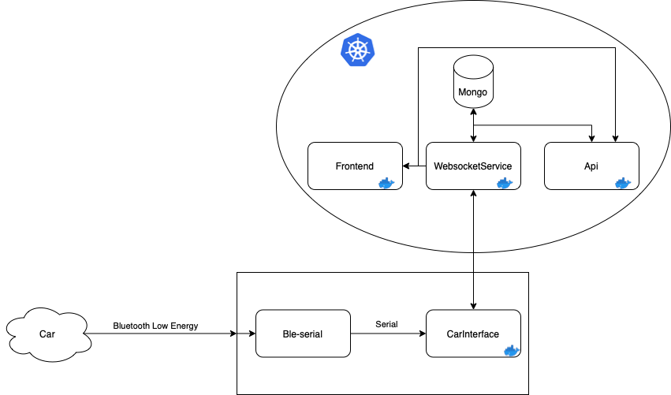

# Specifications

## Purpose
This project aims to retrieve different kind of data from a car, storing them, and showing them on a web page.

## Structure

## Workflow

### Websocket
The goal of the WebSocket part is to send data from the car interface to the backend server for historizing, and to the frontend view to see everything in realtime.

### API
The RESTful API routes are used to user and car management. Routes are used to be fetching car's data and settings.

### Frontend
The website will expose realtime data from the car, alongs with car history, user management, car management.

### CarInterface
Composed of ElmAdapter
Supposedly deployed on a Raspberry Pi, and used to gather data from an ELM Bluetooth Interface (more support to come).
